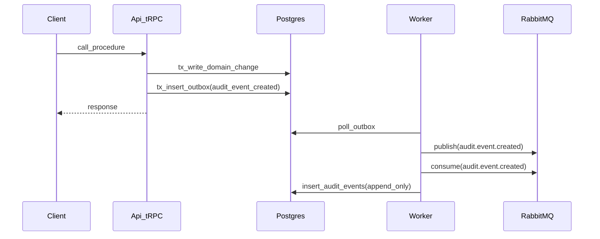

# Step 2 — Audit Event Infrastructure (Plan)

## Goals (from `backlog/v1.0.0/project_setup/requirement_3.md`)

- Add an **append-only** audit trail stored in **Postgres** (`audit_events`).
- Ensure audit events are **tenant-aware**, **actor-aware**, **correlated**, and **data-tagged** (reuse `DataTag` already defined in `packages/core/src/types.ts`).
- Enforce **safe metadata** (no secrets/PHI/tokens/etc.).
- Emit audit events from **API** (tRPC) and **worker**, with correlation across request → outbox → RabbitMQ → consumer.
- Deliver **docs**, **DB migration**, **core types/sanitizer**, **API ctx helper**, and **1–2 pilot audit events**.

## Key repo observations to align with

- **Correlation already exists** in API context (`apps/api/src/adapters/express.ts`) as `correlationId`.
- **Outbox pattern exists** (`outbox_events` + `apps/worker/src/consumers/outbox-dispatcher.ts`) and RabbitMQ publishing includes `correlationId` in message properties (`apps/worker/src/queue/publisher.ts`).
- `DataTag` already exists in `packages/core/src/types.ts`.
- Queue bindings currently only handle `sample.event.*` (`apps/worker/src/queue/setup.ts`), so audit events need their own routing + queue.

## Decisions you made (plan is locked to these)

- **Audit write strategy**: write audit records via **outbox → worker** (non-blocking on worker delivery; request remains transactional on Postgres write).
- **Doc location**: main doc will live under `docs/compliance/procedures/audit-logging.md`.
  - To satisfy the backlog deliverable that mentions `docs/audit-logging.md`, we’ll add a short **stub** `docs/audit-logging.md` that links to the compliance doc.

## Proposed end-to-end flow

## Implementation steps

### 1) `packages/core`: audit types + builders + sanitizer

- Add new folder `packages/core/src/audit/`:
  - `types.ts`: `AuditEvent`, `AuditEventType`, `AuditSeverity`, `AuditStatus`, `AuditActor`.
    - Include `dataTag: DataTag` (from `packages/core/src/types.ts`).
    - Keep `metadata` typed as `Record<string, unknown>` and treat it as **untrusted** until sanitized.
  - `sanitize.ts`: `sanitizeAuditMetadata()` and `sanitizeAuditEvent()`.
    - Strip forbidden keys (e.g. `password`, `token`, `authorization`, `otp`, `secret`) recursively.
    - Enforce max sizes (e.g., metadata JSON string length cap) to prevent unbounded logs.
  - `builders.ts`: helpers like `buildPermissionDeniedAuditEvent(...)`, `buildDomainWriteAuditEvent(...)`.
- Update exports via `packages/core/src/index.ts` so API/worker can import from `@serp/core`.
- Unit tests in `packages/core/src/audit/*.test.ts` verifying sanitizer rules (success + “secrets removed” failure case).

### 2) Postgres: `audit_events` table + indexes (Drizzle)

- Update Drizzle schema in **both**:
  - `apps/api/src/db/schema.ts`
  - `apps/worker/src/db/schema.ts` (worker keeps its own copy)
- Add `auditEvents = pgTable('audit_events', ...)` with:
  - `id` as ULID varchar(26) (matches existing table IDs)
  - `occurredAt`, `eventType`, `eventVersion` (int), `severity`, `tenantId`, `actorType`, `actorId`, `actorDisplay`, `ip`, `userAgent`, `requestId`, `correlationId`, `resourceType`, `resourceId`, `action`, `status`, `reason`, `dataClassification`, `dataCategories` (jsonb array), `metadata` (jsonb)
- Add Drizzle indexes in schema (as supported by drizzle pg-core) matching backlog:
  - `(tenant_id, occurred_at desc)`, `(actor_id, occurred_at desc)`, `(event_type, occurred_at desc)`, `(request_id)`, `(correlation_id)`
- Generate migration via project script: `pnpm db:generate` (runs `apps/api` drizzle-kit).

### 3) Domain event wrapper: `audit.event.created`

- Extend `packages/core/src/events/event-types.ts` with a new domain event type constant:
  - `AUDIT_EVENT_CREATED: 'audit.event.created'`
- Add an event factory in `packages/core/src/events/audit-event-created.ts` (parallel to `sample-event.ts`) that produces a `DomainEvent` whose payload is the **sanitized** `AuditEvent`.
- Document this new event in `docs/infrastructure/events.md` (schema + consumer).

### 4) API: tRPC context + middleware + audit helper

- Extend `packages/trpc/src/context.ts` to include:
  - `requestId` (string)
  - `ip` and `userAgent` (optional)
  - `audit` helper surface (typed) exposed to procedures
- Update `apps/api/src/adapters/express.ts` `createContext` to:
  - generate `requestId` (ULID)
  - keep existing `correlationId` behavior (header override else ULID)
  - populate `ip` and `userAgent` from Express request
- Add `apps/api/src/audit/audit.service.ts`:
  - `enqueueAuditEvent(txOrDb, auditEvent)` → writes `audit.event.created` to `outbox_events` in the **same transaction** when available.
  - No business logic: only sanitization + outbox write.
- Add a tRPC middleware in `apps/api/src/router/index.ts` that:
  - attaches `ctx.audit.log(...)`
  - catches `TRPCError` with `code === 'FORBIDDEN'` and emits `security.permission.denied` (pilot)
    - includes tenant, actor (if known), requestId/correlationId, and safe metadata like `{ permission: 'tenant_scope' }`.

### 5) Worker: queue + consumer that writes `audit_events`

- Update `apps/worker/src/queue/setup.ts`:
  - Add `AUDIT_EVENTS` and `AUDIT_EVENTS_DLQ` queues.
  - Bind `audit.event.*` routing key(s) to the domain exchange.
- Add `apps/worker/src/consumers/audit-event-consumer.ts`:
  - Validate message payload shape (zod locally is fine; data is from queue).
  - Idempotency via `processed_events` (same pattern as sample consumer).
  - Insert into `audit_events` (append-only).
  - On error: `nack(msg, false, false)` to DLQ (mirrors existing consumer behavior).
- Wire consumer in `apps/worker/src/index.ts` alongside existing consumers.

### 6) Pilot audit events (1–2)

- **Pilot #1 (required by backlog example list)**: `security.permission.denied` emitted by middleware when a procedure throws `FORBIDDEN`.
- **Pilot #2 (low-scope, deterministic)**: emit an audit event on `sample.create` success (e.g., `sample.created` or `data.write.created`) to demonstrate “user-triggered write” logging.
  - Tag as `CONFIDENTIAL` + `TENANT/CONTENT` (or `INTERNAL` if you prefer) and keep metadata to IDs/counts only.

### 7) Docs deliverables

- Create `docs/compliance/procedures/audit-logging.md` describing:
  - what is logged (baseline list), forbidden metadata, correlation IDs, tenant/actor rules
  - retention policy placeholder (explicitly marked as TBD with a proposed default range)
  - failure modes: Postgres down (core app already fails), RabbitMQ/worker down (audit inserts delayed; outbox grows)
- Create stub `docs/audit-logging.md` that points to the compliance procedure doc (to satisfy the backlog deliverable location).

### 8) Tests (minimum required by audit rules)

- **Core unit tests**: sanitizer removes secret-like fields and preserves allowed IDs.
- **API integration-style test** (router caller):
  - When triggering `FORBIDDEN`, verify an outbox row for `audit.event.created` is written (failure-path audit).
  - When calling `sample.create`, verify an outbox row for `audit.event.created` is written (success-path audit).
- **Worker integration-style test**:
  - Given an `audit.event.created` message, verify `audit_events` row inserted and `processed_events` recorded.
  - Tenant boundary assertion: inserted `tenant_id` equals message tenant.

### 9) Verification (project-defined commands)

- `pnpm db:generate` and `pnpm db:migrate`
- `pnpm lint`, `pnpm typecheck`, `pnpm test`, `pnpm test:integration`, `pnpm build`
- Final gate: `pnpm verify`

## Scope guardrails (to stay backlog-compliant)

- No new auth system or password hashing library introduced in Step 2.
- No Mongo projections added for audit logs (audit remains Postgres append-only).
- Keep router changes limited to adding middleware + a small audit helper; avoid refactoring existing router validation patterns unless required for audit wiring.