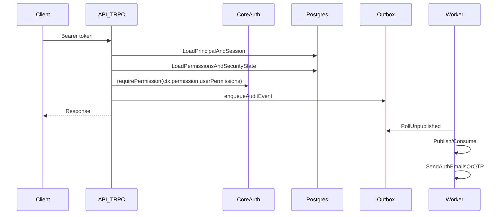

# Auth v1.1.0 Gap Report + Implementation Plan

## What’s missing (source of truth = current code)

### Requirements gaps (from [backlog/v1.1.0/auth/requirement_1.md](backlog/v1.1.0/auth/requirement_1.md))

- **Permission enforcement not wired end-to-end**
  - Policy engine exists in core (`packages/core/src/auth/authorize.ts`) but is **not enforced in tRPC middleware**.
  - Routers contain explicit TODOs to check permissions:
    - `apps/api/src/router/rbac.ts` (member role assignment)
    - `apps/api/src/router/tokens.ts` (API token/service account management)
    - `apps/api/src/router/emergency-access.ts` (break-glass activation/listing)
- **Step-up enforcement for sensitive actions incomplete**
  - `auth.stepUp` endpoint exists, but emergency access activation does not verify a current step-up session.
- **Password reset endpoints missing**
  - Worker email consumer supports `auth.password_reset.requested`, but API router `apps/api/src/router/auth.ts` has no `requestPasswordReset` / `resetPassword` procedures.
- **Passwordless auth endpoints missing**
  - Worker email consumer supports `auth.magic_link.requested`, and OTP consumer supports `auth.otp.requested`, but API router lacks `requestMagicLink`/`consumeMagicLink` and `requestOtp`/`verifyOtp`.
- **Rate limiting not implemented**
  - Requirement mandates rate limiting on auth endpoints; repo code has no rate limiter implementation.
- **Email verification restriction not enforced**
  - Email verification flow exists, but there’s no middleware/policy preventing unverified users from sensitive actions.

### Project rules gaps (from `.cursor/rules/**`)

- **Business logic boundary violation (strict mode requested)**
  - The “Definition of Done” rule requires **no business logic outside `packages/core`**.
  - Today, substantial auth logic is in `apps/api/src/services/auth-service.ts` and `apps/api/src/services/rbac-service.ts`.
- **Audit logging quality**
  - Rule requires “minimal, no secrets/PHI”. `apps/api/src/router/emergency-access.ts` logs and audits the **raw justification** (may contain PHI) and prints it via `console.warn`.
  - Rule requires logging **authorization failures**; currently there’s no central permission middleware, so permission-denied audit events are missing.
- **Testing**
  - Rule requires unit tests for new/modified core logic and integration tests for tRPC procedures. There are currently **no auth/rbac/tokens/emergency integration tests** under `apps/api/src/router/*`.

### Documentation inconsistency

- `.cursor/plans/auth_v1.1.0_implementation_a98f9c3b.plan.md` marks everything “completed”, but current code still contains permission TODOs and is missing password reset/passwordless/rate limiting.
- `docs/implementation-summaries/auth-v1.1.0-status.md` and `auth-v1.1.0-COMPLETE.md` conflict; we should update them to match the actual implementation.

## Implementation strategy (strict core boundary)

### Key principle

- **Core owns domain logic**, API owns **transport + persistence adapters**.
- We’ll refactor auth/RBAC domain operations into `packages/core` with **repository interfaces**, implemented in `apps/api` with Drizzle.

### Target flow

## Step-by-step plan

### 1) Core boundary refactor (must-do first)

- Move/replace `apps/api/src/services/auth-service.ts` domain logic into `packages/core/src/services/auth/`.
  - Define repository interfaces in core (e.g. `AuthRepo`, `RbacRepo`, `TokenRepo`) for reads/writes.
  - Implement those interfaces in `apps/api/src/services/*-repo.ts` using Drizzle.
- Update routers to call core services with repo implementations.

**Files touched**:

- `packages/core/src/services/**` (new)
- `apps/api/src/services/auth-service.ts` (reduced to adapter or removed)
- `apps/api/src/services/rbac-service.ts` (adapter)

### 2) Permission enforcement in tRPC middleware (fix TODOs + meet RBAC requirement)

- Implement `requirePermission(permissionId, opts)` in `packages/trpc/src/middleware.ts` using `packages/core/src/auth/authorize.ts`.
- Implement permission loading in API context (or a shared loader) so middleware has:
  - actor type (user/service)
  - orgId/workspaceId
  - `hasMfa` / `hasStepUp` / `emergencyAccess` (see step 3)
  - `userPermissions` sets
- Replace TODOs by applying middleware in:
  - `apps/api/src/router/rbac.ts`
  - `apps/api/src/router/tokens.ts`
  - `apps/api/src/router/emergency-access.ts`
  - audit-sensitive routers like `apps/api/src/router/gdpr.ts` (verify current checks)

**Files touched**:

- `packages/trpc/src/middleware.ts`
- `packages/trpc/src/context.ts` (if needed)
- `apps/api/src/adapters/express.ts` (context enrichment)
- `apps/api/src/router/{rbac,tokens,emergency-access,gdpr}.ts`

### 3) Step-up + MFA enforcement (HIPAA / sensitive permissions)

- Define and implement the runtime meaning:
  - **MFA enrolled**: verified factor exists (`mfa_factors.verifiedAt != null`).
  - **Step-up active**: unexpired record in `auth_step_up` for current session.
- Update permission middleware to:
  - Throw `MFA_REQUIRED` / `STEP_UP_REQUIRED` codes from core and map to tRPC errors.
  - Enforce org policy: if `org_security_policies.requiresMfa`, then sensitive permissions require MFA step-up.
- Update `emergencyAccess.activateEmergencyAccess` to explicitly require step-up + permission.

**Files touched**:

- `packages/core/src/auth/authorize.ts` (if we need to adjust semantics)
- `apps/api/src/router/auth.ts` (ensure step-up writes are correct)
- `apps/api/src/router/emergency-access.ts`

### 4) Password reset + passwordless endpoints (meet AuthN requirements)

- Add procedures to `apps/api/src/router/auth.ts`:
  - `requestPasswordReset` (non-enumerable)
  - `resetPassword`
  - `requestMagicLink` / `consumeMagicLink`
  - `requestOtp` / `verifyOtp`
- Add corresponding Zod schemas in `packages/validations/src/auth.ts` and exports.
- Implement domain logic in core (token creation/consumption; single-use; expiry; attempt counts).
- Emit outbox events for worker consumers already in place.

**Files touched**:

- `apps/api/src/router/auth.ts`
- `packages/validations/src/auth.ts`
- `packages/core/src/services/auth/**`

### 5) Rate limiting (mandatory control)

- Add a Postgres-backed limiter (table + helper) and apply to:
  - `auth.login`
  - `auth.requestPasswordReset`
  - `auth.requestMagicLink`
  - `auth.requestOtp`
- Ensure responses remain generic/non-enumerable.

**Files touched**:

- `packages/db/src/schema/**` + new migration under `apps/api/drizzle/**`
- `apps/api/src/router/auth.ts`
- `apps/api/src/services/rate-limit.*` (adapter/infra)

### 6) Audit logging hardening

- Add **authorization-failure audit events** in the permission middleware.
- Remove/avoid logging justification text:
  - Stop printing it via `console.warn`
  - Avoid storing it in audit metadata (store only `grantId`, duration, maybe a hash/length)

**Files touched**:

- `apps/api/src/router/emergency-access.ts`
- `apps/api/src/audit/audit.service.ts` or middleware

### 7) Tests (required by DoD)

- **Unit tests** in `packages/core`:
  - permission engine behavior (deny-by-default, humanOnly, requiresMfa, requiresStepUp)
- **Integration tests** in `apps/api/src/router/`:
  - login + refresh rotation + session revocation
  - password reset flow
  - passwordless (magic link + OTP)
  - permission checks for tokens/rbac/emergency access
  - tenant boundary test (cross-org denial)

**Files touched**:

- `packages/core/src/auth/*.test.ts`
- `apps/api/src/router/{auth,rbac,tokens,emergency-access}.test.ts`

### 8) Documentation alignment

- Update:
  - `docs/implementation-summaries/auth-v1.1.0-status.md`
  - `docs/implementation-summaries/auth-v1.1.0-COMPLETE.md`
  - optionally `.cursor/plans/auth_v1.1.0_implementation_a98f9c3b.plan.md` to reflect reality

## Rollout & update checkpoints

- **Checkpoint A**: core-boundary refactor lands; API still functional.
- **Checkpoint B**: permission middleware enforced; TODOs removed; authorization failures audited.
- **Checkpoint C**: password reset + passwordless complete; worker notifications working end-to-end.
- **Checkpoint D**: rate limiting in place.
- **Checkpoint E**: tests + docs + final `pnpm verify`.

## Notes / constraints

- You indicated you can’t share `git status`, so this plan is based on **repo state** rather than mapping specifically to currently modified files.
- Web UI is not included (your plan had it cancelled), unless you explicitly want it in scope.