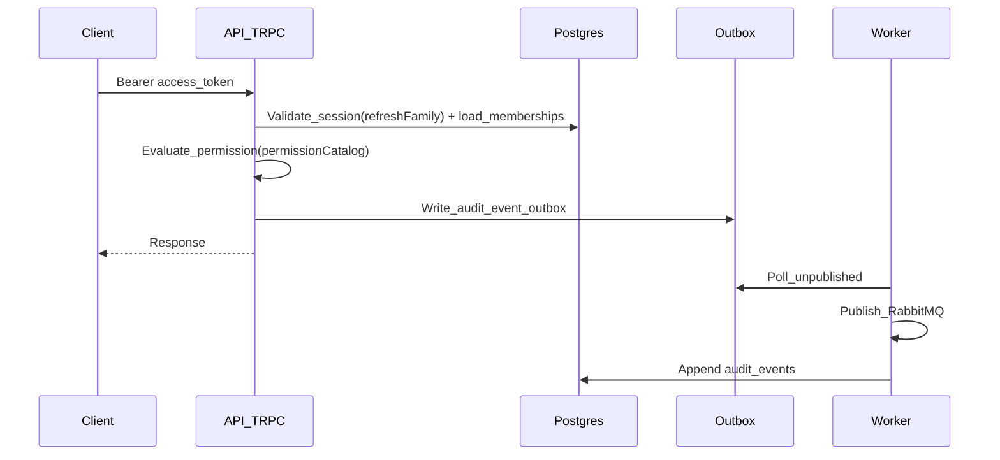

# Authentication & Authorization v1.1.0 Plan

## Scope anchored to your repo

You already have:

- **API scaffolding**: Express + tRPC (`apps/api/src/index.ts`, `apps/api/src/router/index.ts`)
- **Tenant baseline**: `orgs`, `org_memberships` + a simple `roles: string[]` field (`packages/db/src/schema/tenant/org-memberships.ts`)
- **User baseline**: `users` with `passwordHash` (`packages/db/src/schema/auth/users.ts`)
- **Audit system**: outbox → RabbitMQ → worker → `audit_events` (`apps/api/src/audit/audit.service.ts`, `packages/db/src/schema/audit/audit-events.ts`, `docs/compliance/procedures/audit-logging.md`)

You do **not** yet have:

- Real auth context (currently dev headers in `apps/api/src/adapters/express.ts`)
- Sessions/refresh tokens, email verification, password reset
- Workspace model
- Permission catalog + org-managed roles
- MFA + step-up
- Service accounts + API tokens
- Emergency access (break-glass)
- Rate limiting on auth endpoints

## Architecture (target state)

Key decisions (based on your answers):

- **Bearer everywhere**: all clients send `Authorization: Bearer <access_token>`.
- **Short-lived access token + rotating refresh** stored server-side (refresh token **hashed** in DB). Access token contains only minimal identifiers (no PHI), and is revocable via refresh-family/session records.

## Data model changes (Drizzle + migrations)

Update / add schemas in `packages/db/src/schema/**` and generate migrations in `apps/api/drizzle/**`.

### 1) AuthN: sessions + tokens

- **Update** `users` (`packages/db/src/schema/auth/users.ts`)
  - Add: `emailVerifiedAt`, `lastLoginAt`, `lockedUntil`, `failedLoginCount` (or shift to rate-limiter tables)
- **Add** `auth_sessions`
  - `id`, `userId`, `orgId` (or “activeOrgId”), `createdAt`, `lastSeenAt`, `expiresAt`, `revokedAt`, `ip`, `userAgent`, `deviceLabel`
- **Add** `auth_refresh_tokens`
  - `id`, `sessionId`, `tokenHash`, `familyId`, `rotatedAt`, `expiresAt`, `revokedAt`
- **Add** `auth_email_verification_tokens`
  - `id`, `userId`, `tokenHash`, `expiresAt`, `usedAt`
- **Add** `auth_password_reset_tokens`
  - `id`, `userId`, `tokenHash`, `expiresAt`, `usedAt`

### 2) Passwordless

- **Add** `auth_magic_link_tokens`
  - `id`, `userId`, `tokenHash`, `expiresAt`, `usedAt`
- **Add** `auth_otp_codes` (fallback)
  - `id`, `userId`, `codeHash`, `purpose`, `expiresAt`, `usedAt`, `attemptCount`

### 3) AuthZ: permission catalog + org/workspace roles

- **Add** `org_roles`, `org_role_permissions`, `org_member_roles`
  - Replace (or gradually deprecate) `org_memberships.roles` string-array.
- **Add** `workspaces`, `workspace_memberships`, `workspace_roles`, `workspace_role_permissions`, `workspace_member_roles`
- **Add** `org_security_policies`
  - `orgId`, `requiresMfa`, `hipaaMode` (or similar), session lifetime settings

### 4) MFA + step-up

- **Add** `mfa_factors`
  - `id`, `userId`, `type: TOTP`, `secretEncrypted`, `createdAt`, `verifiedAt`, `disabledAt`
- **Add** `mfa_recovery_codes`
  - `id`, `userId`, `codeHash`, `usedAt`
- **Add** `auth_step_up`
  - `id`, `sessionId`, `verifiedAt`, `expiresAt`, `method`

### 5) Service accounts + API tokens

- **Add** `service_accounts`
  - `id`, `orgId`, `name`, `createdAt`, `deletedAt`
- **Add** `api_tokens`
  - `id`, `orgId`, `serviceAccountId?`, `tokenPrefix`, `tokenHash`, `scopes`, `workspaceScope?`, `expiresAt`, `revokedAt`, `createdAt`

### 6) Emergency access (break-glass)

- **Add** `emergency_access_grants`
  - `id`, `orgId`, `userId`, `justification`, `createdAt`, `expiresAt`, `revokedAt`, `revokedByUserId?`

## Permission catalog + policy engine

### Permission catalog (platform-owned)

- Create a versioned permission catalog in `packages/core/src/auth/permissions.ts` (new) defining:
  - `permissionId` (e.g. `org.members.invite`)
  - `scope` (org/workspace/self)
  - flags: `requiresMfa`, `requiresStepUp`, `requiresJustification`, `humanOnly`, `sensitive`

### Evaluation engine (deny by default)

- Implement in `packages/core/src/auth/authorize.ts` (new):
  - Input: actor (user/service), orgId, optional workspaceId, requiredPermission
  - Load: roles → permissions (org + workspace)
  - Enforce: tenant scope, membership, MFA/step-up, emergency access overrides

### tRPC ergonomics

- Extend `packages/trpc/src/context.ts` to include `auth` and `principal` info.
- Add middleware helpers in `packages/trpc/src/middleware.ts`:
  - `requireAuth()` (already exists; will validate bearer token)
  - `requirePermission(permission, opts)`
  - `requireWorkspaceMembership(workspaceId)`

## API work (apps/api)

### Replace mock auth headers

- Update `apps/api/src/adapters/express.ts`:
  - Parse `Authorization` bearer access token
  - Populate context: `principal` (userId/serviceAccountId), `orgId`, `sessionId`, request tracing fields

### Add routers

Add new tRPC routers under `apps/api/src/router/`:

- `auth.ts`
  - `register` (create user + org + membership + bootstrap default roles)
  - `login` (email+password) → issues access + refresh
  - `refresh` (rotate refresh token family) → new access + refresh
  - `logout` (revoke refresh family/session)
  - `requestEmailVerification` / `verifyEmail`
  - `requestPasswordReset` / `resetPassword`
  - `requestMagicLink` / `consumeMagicLink`
  - `requestOtp` / `verifyOtp`
  - `listSessions` / `revokeSession` / `revokeAllSessions`
- `rbac.ts`
  - CRUD org roles, assign/unassign roles to members
  - CRUD workspace roles, assign/unassign to workspace members
  - Ensure “cannot remove last recovery admin role” rule
- `workspaces.ts`
  - create/list/archive workspaces
  - add/remove members, assign workspace roles
- `tokens.ts`
  - create/revoke/list API tokens
  - create/disable service accounts
- `emergency-access.ts`
  - activate/revoke emergency access (requires step-up + justification)

### Auditing

- Emit audit events (via `enqueueAuditEvent`) for all security-relevant actions:
  - login success/failure, logout, token creation/revocation, MFA events, emergency access activation/usage, role changes
- Add additional audit events for sensitive permission usage by hooking `requirePermission()` to optionally log `DATA_READ_RESTRICTED`/etc.

### Rate limiting

- Add rate limiting middleware around auth procedures (login, magic link, OTP) using a Postgres-backed limiter (no Redis in infra).
- Keep error responses non-enumerable (generic failures for login/passwordless initiation).

## Worker work (apps/worker)

### New consumers

Add consumers under `apps/worker/src/consumers/`:

- `auth-email-consumer.ts`: send email verification, password reset, magic links (reuse `NotificationService` / `MailjetAdapter`)
- `auth-otp-consumer.ts`: send OTP via SMS/email (reuse Twilio/Mailjet)

### Event contracts

Add new domain events in `packages/core/src/events/` for:

- `auth.email_verification.requested`
- `auth.password_reset.requested`
- `auth.magic_link.requested`
- `auth.otp.requested`

API writes outbox events; worker sends notifications.

## Client apps (web/mobile/desktop)

### Shared client auth utilities

- Add a shared token client in `packages/trpc/src/client.ts` (or a new `packages/core/src/auth/client.ts`) to:
  - attach bearer access token
  - handle refresh flow

### Minimum UI screens

- `apps/web/src/app/`:
  - login/register, email verification, password reset
  - MFA enroll/verify + recovery codes
  - session management
  - org roles + workspace roles management
  - API tokens + service accounts
  - emergency access activation UI

(For mobile/desktop: start with login/refresh/logout + MFA verification screens; admin consoles can be web-first.)

## Testing & acceptance

- **Unit tests**:
  - permission engine (deny-by-default, scope rules, MFA flags, human-only)
- **Integration tests** (vitest) in `apps/api/src/router/*.test.ts`:
  - login/refresh rotation, session revocation, role assignment, workspace permissions, API token auth, emergency access
- **Security checks**:
  - verify no secrets in audit metadata (align with `docs/compliance/procedures/audit-logging.md`)
  - generic auth errors (no user enumeration)
  - rate-limiting behavior

## Rollout plan

- Phase A: DB migrations + auth context swap (bearer parsing) + basic login/register/refresh/logout
- Phase B: RBAC/permission catalog + replace string-role checks (e.g. in `apps/api/src/router/gdpr.ts`) with `requirePermission()`
- Phase C: MFA + step-up enforcement for sensitive permissions
- Phase D: service accounts/API tokens + request auth for machine identities
- Phase E: emergency access + UI/admin surfaces + hardening (retention defaults, monitoring)

---

## Implementation todos