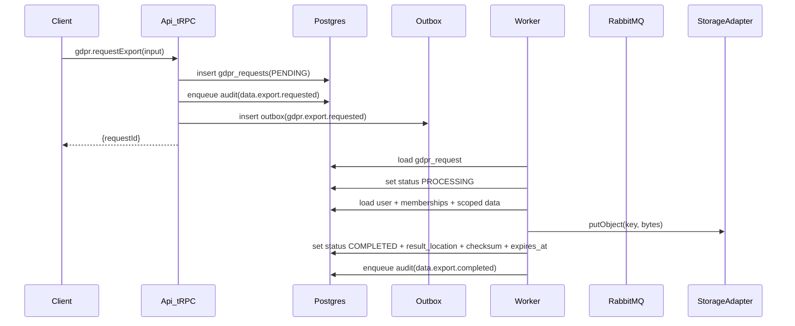
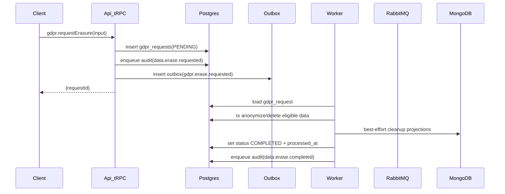

# GDPR Step 3 (Requirement 4) Implementation Plan

## Scope (bound to `backlog/v1.0.0/project_setup/requirement_4.md`)

- Implement **Right of Access / Portability** (async export) and **Right to Erasure** (async delete/anonymize) using **tRPC → Postgres job record → outbox → RabbitMQ → worker**.
- Emit required audit events:
  - `data.export.requested|completed|failed`
  - `data.erase.requested|completed|failed`
- Introduce a **vendor-neutral** `StorageAdapter` interface in `packages/core` and a **local filesystem** adapter for dev.
- Update tenancy model to support **multi-org memberships** (new `org_memberships`), and implement **org-scoped** admin-on-behalf actions.
- Update docs: add `docs/gdpr.md` (flow + inventory + retention), update `docs/infrastructure/events.md` (new event types).
- Add tests: export success, erasure success, permission/tenant boundary.

## Key repo alignment (what we will reuse)

- Existing async pattern: `outbox_events` + worker poller ([`apps/worker/src/consumers/outbox-dispatcher.ts`](apps/worker/src/consumers/outbox-dispatcher.ts)) + RabbitMQ topic exchange ([`apps/worker/src/queue/setup.ts`](apps/worker/src/queue/setup.ts)).
- Existing audit pipeline: API enqueues `audit.event.created` via outbox ([`apps/api/src/audit/audit.service.ts`](apps/api/src/audit/audit.service.ts)), worker persists to `audit_events` ([`apps/worker/src/consumers/audit-event-consumer.ts`](apps/worker/src/consumers/audit-event-consumer.ts)).
- Existing domain event catalog in `packages/core` ([`packages/core/src/events/event-types.ts`](packages/core/src/events/event-types.ts)).

## Decisions locked in (from your answers)

- **Multi-org**: introduce `org_memberships` now (user can belong to multiple orgs).
- **Storage**: implement `StorageAdapter` now + local filesystem adapter.
- **Admin on behalf scope**: **org-scoped only** (must not include or affect other orgs).

## High-level flows

### Export

### Erasure

## Implementation steps (files and responsibilities)

### 1) Data model changes (Postgres / Drizzle)

- **Introduce memberships**
  - Update [`apps/api/src/db/schema.ts`](apps/api/src/db/schema.ts) and [`apps/worker/src/db/schema.ts`](apps/worker/src/db/schema.ts):
    - Add `org_memberships` table:
      - `id` (ULID), `org_id`, `user_id`, `roles` (jsonb string[]), `created_at`, `updated_at`, `deleted_at`.
      - Unique constraint: `(org_id, user_id)`.
    - Update `users` to remove required `org_id` and move org-scoped roles to memberships.

- **Add GDPR job tables**
  - Add `gdpr_requests` (or `privacy_requests`) table:
    - `id` (ULID)
    - `type` (`EXPORT` | `ERASURE`)
    - `status` (`PENDING` | `PROCESSING` | `COMPLETED` | `FAILED`)
    - `scope_org_id` (nullable) — **null = global/self**, set for **admin on behalf** org-scoped jobs
    - `requester_user_id`, `target_user_id`
    - `requested_at`, `processed_at`
    - `result_location` (nullable), `checksum` (nullable), `expires_at` (nullable)
    - `failure_reason` (nullable)
    - `correlation_id` / `request_id`
    - Optional: `mode` for erasure result (`ANONYMIZE` | `DELETE`) if you want it queryable (recommended)
  - Add indexes for common read patterns:
    - `(requester_user_id, requested_at desc)`, `(target_user_id, requested_at desc)`, `(scope_org_id, requested_at desc)`, `(status)`.

- **Migration**
  - Generate and apply deterministic migrations via `pnpm db:generate` and `pnpm db:migrate`.

### 2) Core: Storage abstraction (vendor-neutral)

- Add [`packages/core/src/storage/types.ts`](packages/core/src/storage/types.ts):
  - `StorageAdapter.putObject(key, bytes, contentType) -> { location, checksum }`
  - `StorageAdapter.getSignedUrl(location, expiresInSeconds) -> string`
  - (If we need server-side download without URLs later, we can extend with `getObject`, but we won’t add that unless required.)
- Export from [`packages/core/src/index.ts`](packages/core/src/index.ts).

### 3) Core: GDPR domain service (business logic)

- Add [`packages/core/src/services/gdpr-service.ts`](packages/core/src/services/gdpr-service.ts) implementing:
  - **Export bundle builder**:
    - Input: `{ targetUserId, scopeOrgId?: string | null }`
    - Output: JSON object containing **only**:
      - user profile fields (exclude `passwordHash`)
      - memberships (roles, org ids)
      - notification preferences
      - in-app notification history (minimized)
      - device tokens (token values should be excluded; include counts/metadata only)
      - created content (currently `sample_entities`, if considered personal data)
  - **Erasure/anonymization** decision:
    - For v1.0.0, default to **ANONYMIZE** to preserve referential integrity (per backlog recommendation) unless you explicitly add a hard-delete mode.

Notes:

- The service should operate against interfaces (repositories + storage port). Apps provide adapters.

### 4) Validations: shared Zod schemas

- Add [`packages/validations/src/gdpr.ts`](packages/validations/src/gdpr.ts):
  - `gdprRequestExportInputSchema` (target user id optional for self; scope org for admin)
  - `gdprRequestErasureInputSchema`
  - `gdprGetRequestSchema` / `gdprDownloadSchema` (if implementing download)
- Export from [`packages/validations/src/index.ts`](packages/validations/src/index.ts).

### 5) API: tRPC procedures (orchestration only)

- Add [`apps/api/src/router/gdpr.ts`](apps/api/src/router/gdpr.ts) and register it in [`apps/api/src/router/index.ts`](apps/api/src/router/index.ts).

Procedures (all `protectedProcedure`):

- `gdpr.requestExport`
  - Validate with `packages/validations` schema.
  - **Authorization**:
    - Self: user can request export for self.
    - Admin-on-behalf: require membership role (e.g., includes `'admin'`) within `ctx.orgId`, and set `scope_org_id = ctx.orgId`.
  - Write `gdpr_requests` row + enqueue audit `data.export.requested` + enqueue domain event `gdpr.export.requested` via outbox in a single transaction.

- `gdpr.requestErasure`
  - Same structure, emits `gdpr.erase.requested` and audit `data.erase.requested`.

- `gdpr.getRequestStatus` (minimal)
  - Returns status + timestamps + (for export) `expires_at` and whether result exists.

- `gdpr.getExportDownloadLink` OR `gdpr.downloadExport`
  - Because auth is currently “mock via headers”, we’ll prefer a **tRPC call-based** download (UI calls a procedure and receives JSON) rather than a clickable URL.
  - If you still want URLs, we can return a relative `/trpc/...` URL, but it won’t work cleanly until real auth (cookies/JWT) is in place.

### 6) Worker: queue bindings + consumers

- Update [`apps/worker/src/queue/setup.ts`](apps/worker/src/queue/setup.ts):
  - Add queues + DLQs:
    - `gdpr.export`
    - `gdpr.export.dlq`
    - `gdpr.erase`
    - `gdpr.erase.dlq`
  - Bind routing keys:
    - `gdpr.export.requested`
    - `gdpr.erase.requested`

- Add worker consumers:
  - [`apps/worker/src/consumers/gdpr-export-consumer.ts`](apps/worker/src/consumers/gdpr-export-consumer.ts)
  - [`apps/worker/src/consumers/gdpr-erase-consumer.ts`](apps/worker/src/consumers/gdpr-erase-consumer.ts)

Consumer requirements:

- **Idempotent** using `processed_events`.
- **Transactional** job status updates in Postgres:
  - `PENDING -> PROCESSING -> COMPLETED|FAILED`.
- **Audit**:
  - On completion: enqueue `data.export.completed` / `data.erase.completed`.
  - On failure: enqueue `data.export.failed` / `data.erase.failed` with safe reason.

### 7) Worker: local filesystem StorageAdapter implementation

- Add [`apps/worker/src/adapters/storage/local-fs.ts`](apps/worker/src/adapters/storage/local-fs.ts) implementing `StorageAdapter`.
  - Store files under a configurable directory (e.g., `./.local-storage/exports/`), keyed by `gdpr/<requestId>.json`.
  - Generate checksum (sha256) and store it in Postgres.
  - `getSignedUrl` can return a placeholder (not used until real auth); the primary download path will be `gdpr.downloadExport` via API.

### 8) Mongo projection cleanup (best-effort)

- Add a small worker helper invoked by erasure consumer:
  - Deletes any known user-scoped projection docs (none exist today beyond `sample_projections`, so this will be minimal and safe).
  - Must **not** break erasure if Mongo is down (log + continue).
- Document this behavior in `docs/gdpr.md` under “Derived systems”.

### 9) Documentation

- Add [`docs/gdpr.md`](docs/gdpr.md) including:
  - Export & erasure flow (API + worker)
  - Data inventory map (Postgres tables: `users`, `org_memberships`, `notification_preferences`, `in_app_notifications`, `device_tokens`, `sample_entities`, `audit_events` rules)
  - What is excluded (password hashes, tokens, OTPs)
  - Retention: export expiry (`expires_at`) and recommended defaults
  - Failure modes:
    - Mongo down: best-effort cleanup skipped
    - RabbitMQ/worker down: requests remain pending/processing; core app continues

- Update [`docs/infrastructure/events.md`](docs/infrastructure/events.md):
  - Add event schemas:
    - `gdpr.export.requested`
    - `gdpr.erase.requested`

### 10) Tests (required by backlog + repo rules)

- **API integration tests** (Vitest in [`apps/api/src/router`](apps/api/src/router)):
  - Export success: `gdpr.requestExport` inserts `gdpr_requests` + outbox event + audit requested.
  - Erasure success: `gdpr.requestErasure` inserts request + outbox + audit requested.
  - Permission boundary:
    - Non-admin attempting admin-on-behalf should be rejected (and should generate `security.permission.denied` via existing middleware).

- **Worker integration tests** (Vitest in [`apps/worker/src/consumers`](apps/worker/src/consumers)):
  - Export consumer processes message → writes file via StorageAdapter → updates request to COMPLETED → enqueues audit completed.
  - Erasure consumer processes message → anonymizes data + cleans device tokens → sets COMPLETED → enqueues audit completed.

## Traceability (what we’ll be able to report when implemented)

- **DB**: Drizzle schema + migrations touching `users`, `org_memberships`, `gdpr_requests` (+ indexes).
- **Core**: `StorageAdapter` port + `GdprService` domain logic + audit builders reuse.
- **API**: new `gdpr` tRPC router procedures that only validate/auth/scope/enqueue.
- **Worker**: new `gdpr` consumers + local FS storage adapter.
- **Docs**: `docs/gdpr.md` + `docs/infrastructure/events.md` updated.
- **Tests**: success/failure/permission/tenant boundary coverage per rules.

## Verification (when implementing later)

- `pnpm db:generate && pnpm db:migrate`
- `pnpm test:integration` (requires `pnpm infra:up`)
- Final gate: `pnpm verify`