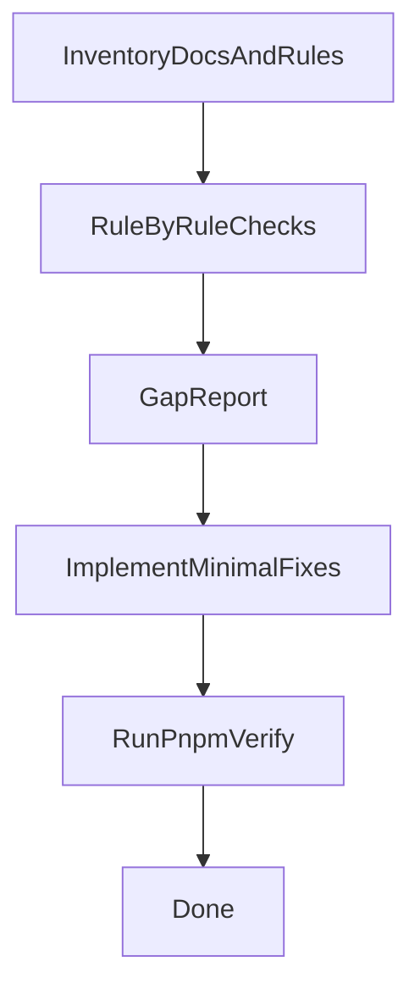

# Project Setup Compliance Audit & Fix Plan

## Scope

Audit **entire repo** against:

- Cursor workspace rules in `.cursor/rules/**/RULE.md`
- Project documentation in `docs/**`
- Backlog “project setup” requirements in [`backlog/v1.0.0/project_setup`](backlog/v1.0.0/project_setup)

Then implement **minimal, backlog-aligned fixes** and run the repo-defined completion gate: `pnpm verify` (root script in [`package.json`](package.json)).

## Phase A — Baseline inventory (read-only)

- Read and distill the “source of truth” requirements:
  - [`docs/infrastructure/runbook.md`](docs/infrastructure/runbook.md) (how to run locally; infra expectations)
  - [`docs/general/model-usage-policy.md`](docs/general/model-usage-policy.md) (process/model policy)
  - [`docs/data-classification.md`](docs/data-classification.md) (classification rules)
  - [`docs/audit-logging.md`](docs/audit-logging.md) and [`docs/gdpr.md`](docs/gdpr.md)
  - [`docs/infrastructure/events.md`](docs/infrastructure/events.md) and [`docs/infrastructure/mongo-projections.md`](docs/infrastructure/mongo-projections.md)
  - Backlog requirements: `requirement_1.md`–`requirement_4.md` in [`backlog/v1.0.0/project_setup`](backlog/v1.0.0/project_setup)
- Inventory repo “setup surface area”:
  - Workspace + scripts: [`package.json`](package.json), [`pnpm-workspace.yaml`](pnpm-workspace.yaml), [`turbo.json`](turbo.json), root [`tsconfig.json`](tsconfig.json), [`docker-compose.yml`](docker-compose.yml)
  - App/package manifests: `apps/*/package.json`, `packages/*/package.json`

## Phase B — Rule-by-rule structural compliance checks (read-only)

Use a checklist mapped to your rules to validate:

### B1) Monorepo structure & boundaries

- Verify top-level directories match required structure: `apps/`, `packages/`, `backlog/`, `docs/`, `infra/` (if present), `scripts/` (if present).
- Verify **no forbidden dependencies**:
  - `packages/*` must not import from `apps/*`.
  - UI apps must not import DB/schema directly.
  - `packages/core` contains business logic; `apps/api` routers orchestrate.

### B2) Commands & verification gate

- Confirm required scripts exist and are canonical:
  - `pnpm verify` exists (it does in [`package.json`](package.json))
  - `pnpm infra:*` scripts exist (they do)
  - `pnpm test:integration` exists (it does)
- Cross-check docs mention the same scripts (update docs if they drift).

### B3) API (tRPC) structure + MVP patterns

Inspect [`apps/api/src`](apps/api/src) to confirm required folder roles:

- `router/` contains routers only
- `context/`, `middlewares/`, `services/`, `adapters/`, `errors/` exist where required and are used consistently
- Each procedure:
  - validates via Zod schemas from [`packages/validations`](packages/validations)
  - enforces auth/tenant via middleware
  - calls domain services in [`packages/core`](packages/core)
  - returns minimal payload

### B4) Worker EDA structure + messaging contracts

Inspect [`apps/worker/src`](apps/worker/src) to confirm:

- `consumers/` are thin (parse→validate→handler)
- `handlers/` exists (or gaps to fix if handling logic is in consumers)
- Messages are versioned and contain required envelope fields
- Idempotency, retry/DLQ behavior is implemented (or gaps documented/fixed)

### B5) Data layer & derived stores

- Confirm Postgres is system of record and Drizzle schemas follow the schema organization rule (no schema duplication inside apps).
- Confirm Mongo usage is derived/projection only and degrade-gracefully paths exist.

### B6) Security/compliance gates

- Audit logging coverage for required events.
- GDPR workflow shape (request→job→worker→completion/failure + audits) matches docs.
- Verify logs avoid secrets/PHI.

## Phase C — Gap report (actionable)

Produce a concise report grouped by rule area:

- **Finding** (what violates which rule/doc)
- **Impact** (risk/bug/perf/compliance)
- **Fix approach** (minimal diff)
- **Files to change**
- **Tests/doc updates required**

## Phase D — Implement minimal fixes (code + docs)

For each gap (one-by-one):

- Implement changes in the correct layer (routers thin; business logic in `packages/core`; validations in `packages/validations`; worker orchestration in worker).
- Add/adjust tests per rules:
  - new/changed procedures → integration tests
  - new/changed domain logic → unit tests
  - perf-sensitive changes → sanity guard test
- Update docs that are now incorrect/outdated:
  - runbook commands
  - events/contracts
  - mongo projections doc (if projections touched)
  - audit/gdpr docs as needed

## Phase E — Verification (required)

Run repo-defined checks:

- `pnpm verify` (root)
- If API/worker changes: also run `pnpm test:integration` (root) when applicable
- If infra behavior changes: validate `pnpm infra:up`/`pnpm infra:reset` instructions in runbook match reality

## Deliverables

- A gap report with direct links to affected files.
- Minimal code/doc fixes for each gap.
- Confirmation of passing `pnpm verify` (and `pnpm test:integration` when relevant).
