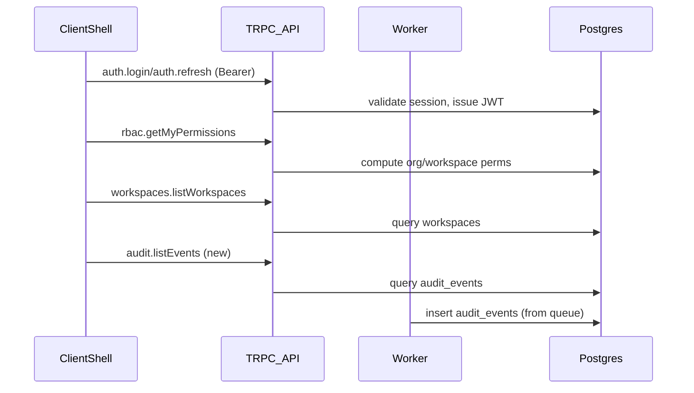

# v1.2.0 UI Requirement 1 Implementation Plan

## Context recap (from repo + requirements)

- The repo already has **platform-owned permissions** and an authorization engine (`packages/core/src/auth/permissions.ts`, `packages/core/src/auth/authorize.ts`).
- The API already exposes core **governance** capabilities:
- **Auth** (login/refresh/logout, MFA, step-up) via [`apps/api/src/router/auth.ts`](apps/api/src/router/auth.ts).
- **RBAC** (roles, assign roles, my permissions) via [`apps/api/src/router/rbac.ts`](apps/api/src/router/rbac.ts).
- **Workspaces** via [`apps/api/src/router/workspaces.ts`](apps/api/src/router/workspaces.ts).
- **API tokens / service accounts** via [`apps/api/src/router/tokens.ts`](apps/api/src/router/tokens.ts).
- **Emergency access (break-glass)** via [`apps/api/src/router/emergency-access.ts`](apps/api/src/router/emergency-access.ts).
- The worker writes audit events into a shared `audit_events` table (projection/append-only) via [`apps/worker/src/consumers/audit-event-consumer.ts`](apps/worker/src/consumers/audit-event-consumer.ts) and the schema exists in [`packages/db/src/schema/audit/audit-events.ts`](packages/db/src/schema/audit/audit-events.ts).
- The clients are currently minimal stubs (no shell, no auth provider, no permission-driven nav):
- Web: [`apps/web/src/app/layout.tsx`](apps/web/src/app/layout.tsx) / [`apps/web/src/app/page.tsx`](apps/web/src/app/page.tsx)
- Desktop: [`apps/desktop/src/App.tsx`](apps/desktop/src/App.tsx)
- Mobile: [`apps/mobile/app/_layout.tsx`](apps/mobile/app/_layout.tsx)

## Goal (Phase 1)

Implement the **permission-driven workspace shell** and the **Governance workspace** across:

- **Web** (primary)
- **Desktop** (same UX as web, Electron wrapper)
- **Mobile** (adaptive projection; mostly read-only)

Auth model: **client-rendered shell using Bearer tokens** (per your answer).

## High-level architecture

### Shared concepts

- **Identity context**: who am I (principal), where am I (org, optional workspace), what can I do (permissions).
- **Permission resolver**: fetch `rbac.getMyPermissions` + `workspaces.listWorkspaces` and produce:
- visible navigation nodes
- route guards
- “disabled” state for write actions (later, per module)
- **Module catalog** (platform-owned, versioned): static code registry describing modules + governance sections + required permissions.

### Data flow (Web/Desktop/Mobile)

## What must be built to satisfy the requirement

### 1) Shared “platform-owned” UI model (new shared package)

Create a small shared package (framework-agnostic TypeScript) that all three apps can import.

- **Navigation types**: `NavigationNode`, `ModuleId`, `RouteId`.
- **Module catalog**: Governance sections (Organization, Workspaces, Roles, Security, API tokens, Audit logs, Compliance, Billing) with `requiredPermissions`.
- **Permission filtering**: `filterNavByPermissions(nodes, permissionSet)` implementing:
- visible if `ANY(requiredPermissions)`
- hide empty groups
- (Phase 1) disabled state can be derived from presence/absence of “manage/update” perms.

### 2) API support gaps for Governance UI

Add missing read APIs needed by the shell + governance screens.

- **Audit log viewer API**: new router (e.g. `audit.listEvents`) that queries `audit_events` and is gated by `org.audit.read`.
- Filters: time range, actor, eventType, status, free-text on resourceId/requestId/correlationId.
- Pagination + stable ordering.
- **(If missing) org info endpoint**: to render org switcher label + org settings.
- If multi-org membership already exists in DB, add `orgs.listMyOrgs` and `orgs.getCurrentOrg`.
- If not, Phase 1 can assume single org from token and just show the orgId/name placeholder.

### 3) Web app shell (Next.js)

- Add **providers** at app root:
- `AuthProvider` (token storage, refresh flow, sign-in/out)
- `IdentityProvider` (selected workspace)
- `TRPCProvider` (creates client with `Authorization` header)
- Implement **ShellLayout**:
- Top bar: org switcher, workspace switcher, notifications placeholder, user menu
- Side nav: generated from module catalog filtered by permissions
- Module host: route outlet
- Implement **route guards**:
- Client-side redirect to `/login` if no token
- Permission gate component (`<RequirePermission perms=[...]>`) for governance pages
- Implement Governance screens:
- Workspaces list/create (wired to `workspaces.*`)
- Roles list/create/assign (wired to `rbac.*`)
- Security: MFA enroll/verify + step-up + emergency access (wired to `auth.*` + `emergencyAccess.*`)
- API tokens & service accounts (wired to `tokens.*`)
- Audit logs (wired to new `audit.listEvents`)
- Compliance/Billing: placeholders (until backend exists)

### 4) Desktop shell (Electron + Vite)

- Mirror the Web shell UX using the same shared module catalog + permission filtering.
- Implement the same providers pattern (token storage, trpc client).
- Use the same governance screens where possible (React DOM).
- If we want maximum reuse, place shared React UI in a shared package used by both web+desktop.

### 5) Mobile shell (Expo)

- Implement an adaptive shell:
- Simple header + module list (instead of persistent sidebar)
- Workspaces switcher (if applicable)
- Governance is mostly hidden; show only allowed sections
- Mobile affordances:
- Default read-only; wire only safe read endpoints first (workspaces list, roles list, audit read)
- Actions like “create role/workspace” can be gated/hidden for Phase 1 mobile if desired.

## Milestones

- **M1 (Infrastructure)**: shared module catalog + permission filtering + auth/token utilities
- **M2 (Web)**: functional shell + login + governance pages + audit viewer
- **M3 (Desktop)**: parity shell + governance
- **M4 (Mobile)**: adaptive shell with minimal governance read surfaces

## Key files/directories expected to change

- Shared package (new): `packages/*` (e.g. `packages/shell-core/`)
- Web: [`apps/web/src/app`](apps/web/src/app) and new `apps/web/src/components/*`, `apps/web/src/lib/*`
- Desktop: [`apps/desktop/src`](apps/desktop/src)
- Mobile: [`apps/mobile/app`](apps/mobile/app)
- API: [`apps/api/src/router`](apps/api/src/router) (add audit + possibly org routers)

## Acceptance criteria

- **No persona-based UI forks**: UI renders purely from permissions + context.
- **Sidebar is generated** from module catalog and filtered by resolved permissions.
- **Routes are gated** (client-side) and buttons are disabled/hidden consistently.