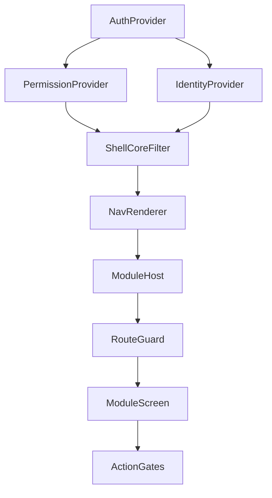

# Admin Panel Workspace Shell (v1.2.0)

## Goals (from `backlog/v1.2.0/ui/requirement_2.md`)

- **Single shell concept across Web + Desktop + Mobile**: identity context, permission resolver, permission-driven nav renderer, module host, global scaffolds.
- **No role/persona hardcoding**: UI is a projection of **permissions + context** only.
- **Permission enforcement in 3 layers**: navigation visibility/disabled, route/screen guard, action gating.
- **Theme**: strict black/white grayscale only; light/dark are **true inverses**.
- **Governance workspace**: separate section + route namespace, stricter UI behavior (“audit required” badge), and audit data labeling using `PUBLIC/INTERNAL/CONFIDENTIAL/RESTRICTED`.

## Current state (what we will leverage)

- **Shared nav + filtering already exists** in `packages/shell-core` (`moduleCatalog`, `filterNavByPermissions`).
- Key files: [`packages/shell-core/src/catalog.ts`](packages/shell-core/src/catalog.ts), [`packages/shell-core/src/filter.ts`](packages/shell-core/src/filter.ts), [`packages/shell-core/src/types.ts`](packages/shell-core/src/types.ts)
- **Web already has the shell skeleton**:
- Providers wired: [`apps/web/src/app/providers.tsx`](apps/web/src/app/providers.tsx)
- Permission + identity contexts: [`apps/web/src/context/permission-context.tsx`](apps/web/src/context/permission-context.tsx), [`apps/web/src/context/identity-context.tsx`](apps/web/src/context/identity-context.tsx)
- Shell layout: [`apps/web/src/components/shell.tsx`](apps/web/src/components/shell.tsx)
- Governance routes exist under `/app/governance/*`: [`apps/web/src/app/app/governance/*`](apps/web/src/app/app/governance)
- **Auth/RBAC APIs are real**:
- `rbac.getMyPermissions` in [`apps/api/src/router/rbac.ts`](apps/api/src/router/rbac.ts)
- `workspaces.listWorkspaces/createWorkspace` in [`apps/api/src/router/workspaces.ts`](apps/api/src/router/workspaces.ts)
- `audit.listEvents` returns `dataClassification` + `dataCategories` in [`apps/api/src/router/audit.ts`](apps/api/src/router/audit.ts)
- **Shadcn + Tailwind are ready** for web/desktop (per [`docs/implementation-summaries/shadcn-manual-setup.md`](docs/implementation-summaries/shadcn-manual-setup.md)).

## Plan (implementation order mirrors the spec)

### 0) Inventory & safety checks (read-only conclusions)

- Web: Next App Router already uses `/app/*` with `ShellLayout` in [`apps/web/src/app/app/layout.tsx`](apps/web/src/app/app/layout.tsx).
- Desktop: currently a single screen prototype in [`apps/desktop/src/App.tsx`](apps/desktop/src/App.tsx) (no real route host yet).
- Mobile: Expo Router is present (Stack-only), but `apps/mobile/app/index.tsx` currently has **two default exports** (must be corrected when we implement the shell).

### 1) Define shared concepts (central contract)

Update `@serp/shell-core` to match the v1.2.0 contract while keeping it **UI-agnostic**:

- Extend `NavigationNode` in [`packages/shell-core/src/types.ts`](packages/shell-core/src/types.ts):
- add `platforms?: Array<'web'|'desktop'|'mobile'>`
- keep `requiredPermissions` and `disabledWhenMissing`
- Add shared helpers in `shell-core` (pure functions) and export them from [`packages/shell-core/src/index.ts`](packages/shell-core/src/index.ts):
- `hasAny(granted, required)` / `hasAll(...)`
- `guardRoute(granted, required) => { allowed: boolean }`
- `canWrite(granted, moduleOrNode)` using the chosen MVP rule (**generic `workspace.data.write`**) plus `disabledWhenMissing`
- Update `filterNavByPermissions(...)` in [`packages/shell-core/src/filter.ts`](packages/shell-core/src/filter.ts) to also:
- filter by `platforms` when a platform is provided
- hide empty groups (already mostly true; ensure no group node survives with no children)
- Update [`packages/shell-core/src/catalog.ts`](packages/shell-core/src/catalog.ts) to:
- remove `as PermissionId` casts where possible
- add `disabledWhenMissing: ['workspace.data.write']` for operational modules so read-only users see modules but actions are disabled
- add `platforms` so mobile shows only the operational subset (Projects, Documents; Governance only via “More” and only if permitted)

### 2) Implement shell UI layers (all platforms)

#### Web (`apps/web`)

- Keep existing `AuthProvider` and contexts; evolve them to expose the full contract required by the spec:
- `IdentityProvider`: include `activeOrgId` (MVP: from auth context / server context when available), keep workspace switcher API.
- `PermissionProvider`: already calls `rbac.getMyPermissions`.
- Add a top-bar scaffold (org/workspace switcher placeholders, global search placeholder, notifications placeholder, user menu + logout) inside [`apps/web/src/components/shell.tsx`](apps/web/src/components/shell.tsx).

#### Desktop (`apps/desktop`)

- Replace the prototype single-file logic with the same conceptual layers as web:
- `src/context/auth-context.tsx` (token storage + trpc client)
- `src/context/permission-context.tsx` (call `rbac.getMyPermissions`)
- `src/context/identity-context.tsx` (call `workspaces.listWorkspaces`, manage active workspace)
- `src/components/shell/ShellLayout.tsx` (sidebar + top bar + module host)
- Use the shared `@serp/shell-core` nav tree and helpers; do **not** introduce a role-based menu.

#### Mobile (`apps/mobile`, Expo Router)

- Implement a real shell using Expo Router **Tabs**:
- `app/(shell)/_layout.tsx` as `Tabs`
- `app/login.tsx` for sign-in (MVP: email/password)
- `app/(shell)/projects.tsx`, `app/(shell)/documents.tsx`, `app/(shell)/more.tsx`
- Add mobile providers (React context) mirroring the same contract:
- `IdentityProvider`: workspaces list + active workspace setter
- `PermissionProvider`: call `rbac.getMyPermissions`
- Fix `apps/mobile/app/index.tsx` to be a single entry that redirects to `/login` or `/(shell)/projects` based on auth state.

### 3) Navigation renderer (dynamic)

- Keep a **single registry** in `shell-core` and render it per platform:
- Web/Desktop: left sidebar (collapsible later; MVP non-collapsible ok)
- Mobile: Tabs show only mobile-eligible modules; “More” shows the rest filtered by permissions (Governance only if allowed)
- Ensure rules:
- visible if user has **ANY** of node required perms
- disabled if visible but missing the configured write perm (`workspace.data.write` / node’s `disabledWhenMissing`)

### 4) Module host + standard module layout (MVP scaffolding)

#### Web

Create scaffold routes under `apps/web/src/app/app/`:

- `projects/page.tsx` (requires `workspace.data.read`, action gated by `workspace.data.write`)
- `documents/page.tsx` (same)
- `accounting/page.tsx` (optional for parity with current catalog, “Coming soon”)

Add a reusable `ModuleLayout` (shadcn components) under `apps/web/src/components/module-layout.tsx`.

#### Desktop

Implement module host rendering based on selected nav route id (no new router dep for MVP):

- `ProjectsModule`, `DocumentsModule`, `GovernanceRolesModule`, `GovernanceAuditModule` (placeholders) rendered inside Shell main content.

#### Mobile

- Create screens using RN primitives styled via a tiny RN UI kit:
- `apps/mobile/lib/theme.ts` + `useTheme()`
- `apps/mobile/components/Button.tsx`, `Card.tsx`, `Header.tsx`, `ListRow.tsx`
- Screens: Projects + Documents have at least one CTA disabled without `workspace.data.write`.

### 5) Permission enforcement layers (everywhere)

- **Navigation**: already filtered in `shell-core`; ensure disabled state is applied.
- **Route/screen guard**:
- Web: `RequirePermission` wrapper (supports multiple perms) renders an in-shell “Not authorized” view.
- Desktop: same guard before rendering module content.
- Mobile: same guard inside each screen; show a clear explanation.
- **Action gating**:
- Standard helper: `isActionEnabled = permissions.has('workspace.data.write')`
- Sensitive action scaffolding: if permission metadata says requiresStepUp/requiresMfa (from `@serp/core` permission catalog), show a modal “Step-up required” (UI only).

### 6) Look & Feel: strict black/white inverted theme

- Web/Desktop: adjust shadcn CSS variables in:
- [`apps/web/src/styles/globals.css`](apps/web/src/styles/globals.css)
- [`apps/desktop/src/styles/globals.css`](apps/desktop/src/styles/globals.css)

to remove non-grayscale accents (notably `--chart-*`, and ensure `--destructive` stays grayscale), and ensure `.dark` is a strict inversion.

- Add a simple theme toggle in web/desktop shell header that toggles `.dark` on the root element and persists preference.
- Mobile: implement the same tokens in `theme.ts` and invert based on OS scheme + an optional in-app toggle.

### 7) Governance workspace (scaffold + stricter behavior)

- Web already has governance routes; enhance them to meet the spec:
- Add an “Audit required” badge in the header area for governance screens.
- In Audit Logs UI, display `dataClassification` and a compact rendering of `dataCategories`.
- Do **not** render `metadata` verbatim (avoid accidental sensitive leakage); keep it collapsed/redacted by default.
- Desktop/Mobile: add Governance entry points via the shared registry (desktop sidebar, mobile “More” screen), with placeholders for:
- Roles & Permissions (view + create already exists on web)
- Audit Logs (read-only list)

### 8) Tests (minimal regression suite)

- `packages/shell-core` unit tests:
- `hasAny/hasAll` behavior
- nav filtering (visibility + empty-group hiding)
- platform filtering (mobile subset)
- route guard decisions
- Web/Desktop component tests (minimal) verifying:
- sidebar hides “Accounting” without `workspace.data.read`
- “Projects” appears with `workspace.data.read`
- CTA disabled without `workspace.data.write`
- Mobile tests (minimal): verify registry filtering for `platforms:['mobile']` and the guard decision for a screen.

## Key risks / gotchas to avoid

- Don’t introduce role/persona conditionals anywhere (no `if (role === ...)`).
- Don’t fork nav trees per platform; use one registry + `platforms` filtering.
- Don’t leak RESTRICTED fields in audit UI; classification must be visible, metadata minimal.
- Keep business logic centralized (filtering/helpers in `@serp/shell-core`, permission catalog in `@serp/core`).

## Mermaid: high-level shell data flow

