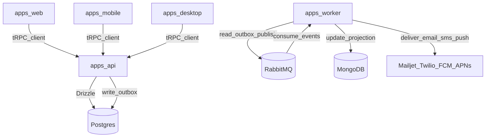

# v1.0.0 Project Setup Implementation Plan

## Scope (binding)

Implements exactly what’s described in [`backlog/v1.0.0/project_setup/requirement_1.md`](backlog/v1.0.0/project_setup/requirement_1.md):

- TurboRepo monorepo with pnpm, strict TS, shared eslint/prettier/tsconfig.
- Apps: `apps/web` (Next App Router), `apps/mobile` (Expo), `apps/desktop` (Electron+Vite), `apps/api` (tRPC), `apps/worker`.
- Packages: `packages/core`, `packages/validations`, `packages/trpc`, `packages/config`.
- Postgres (system of record) with Drizzle schema+migrations.
- RabbitMQ async jobs/events with retries + DLQ; idempotent consumers.
- MongoDB derived projections updated from sample domain events.
- Notification subsystem: in-app notifications in Postgres; push/email/SMS via worker; real provider integrations (sandbox/test creds) behind adapters and supporting dry-run mode for dev.
- CI scripts run lint/typecheck/test/build.

## Key decisions already confirmed

- `apps/web`: Next.js **App Router**.
- Providers: **real sandbox/test-credential integration** for Mailjet/Twilio/FCM/APNs.
- `apps/mobile`: **Expo**.
- `apps/desktop`: **Electron + Vite + React** renderer.

## Repo bootstrap (monorepo + shared config)

- Initialize pnpm workspaces + TurboRepo pipeline.
- Add strict root TypeScript config and shared presets in `packages/config`:
  - `tsconfig` bases (strict)
  - eslint config package
  - prettier config package
- Add root scripts in `package.json` (single source of truth) used everywhere:
  - `pnpm lint`, `pnpm typecheck`, `pnpm test`, `pnpm test:integration` (if integration harness is present), `pnpm build`, `pnpm verify`
  - `pnpm infra:up|down|reset` (compose)
  - `pnpm db:generate|migrate|reset` (drizzle)

## App scaffolding

- `apps/web`:
  - Next App Router baseline.
  - tRPC client wiring from `packages/trpc`.
- `apps/mobile`:
  - Expo baseline.
  - tRPC client wiring from `packages/trpc`.
- `apps/desktop`:
  - Electron main + Vite React renderer.
  - tRPC client wiring from `packages/trpc`.
- Ensure each app has minimal “health” page/screen that can call a sample tRPC query.

## tRPC API (apps/api) + shared contract (packages/trpc)

- Implement `packages/trpc`:
  - shared router types, client factory, shared middleware helpers.
- Implement `apps/api`:
  - tRPC router with:
    - Zod validation imported from `packages/validations`
    - auth + tenant scoping via middleware (not inside handlers)
    - handlers orchestrate calls into `packages/core` services
  - Express runtime adapter (required).
  - Serverless adapter: scaffolded behind a separate entrypoint (supported, kept minimal since optional in backlog).
  - Structured logging + correlation/request IDs propagated into emitted events.

## Data layer (Postgres + Drizzle)

- Implement minimal schema and migrations (Drizzle) to support required deliverables:
  - `orgs/tenants`, `users` (minimum for auth + tenant scoping)
  - `in_app_notifications` (authoritative)
  - `notification_preferences`
  - `device_tokens` (per user/org)
  - `outbox_events` (transactional outbox for domain events)
- Enforce:
  - globally unique IDs (UUID/ULID—pick one and use consistently)
  - `created_at`, `updated_at`, optional `deleted_at`
  - optimistic concurrency (e.g. `version` column) where mutations require it

## Domain layer (packages/core)

- Implement:
  - domain services for notifications (single domain-level interface)
  - domain events (types + versions) and an event emitter that writes to outbox
  - a sample domain event used for the “end-to-end” demo (e.g., `sample.event.created`), with tenant + correlation metadata
- No DB writes or business logic in routers.

## Worker + messaging (apps/worker)

- Implement RabbitMQ integration:
  - queues/exchanges, retry policy, DLQ
  - idempotency strategy (e.g., processed-event table keyed by `event_id`)
- Implement consumers:
  - outbox dispatcher: reads new outbox rows and publishes to RabbitMQ
  - sample event consumer: updates Mongo projection + triggers notification deliveries
- Ensure worker does not crash on provider failures; failures are retried then DLQ’d.

## MongoDB projections (derived read model)

- Define at least one projection collection updated from the sample event.
- Create indexes matching the query pattern.
- Document rebuild strategy (replay from Postgres outbox/events).

## Provider adapters (real integrations + dry-run)

- Implement adapters in API/worker runtime boundaries (per repo conventions):
  - Mailjet adapter (email)
  - Twilio adapter (SMS)
  - FCM/APNs adapters (push)
- Support:
  - sandbox/test credentials
  - dry-run mode for local dev
  - invalid token handling (mark token invalid, stop retrying that token when appropriate)

## Environment + ops

- Add strict `.env` schema validation (API + worker) including:
  - DB URLs, RabbitMQ URL, Mongo URL
  - provider creds + dry-run toggles
- Add Docker Compose for local Postgres/Mongo/RabbitMQ.
- Add minimal runbook notes under `docs/`:
  - how to start infra, run migrations, run apps, and troubleshoot queues
  - failure modes: Mongo down (dashboards degrade), Rabbit down (jobs delayed), provider failures (retry/DLQ)

## Testing (Definition of Done)

- Unit tests:
  - `packages/core` services (success + failure + tenant boundary)
- Integration tests:
  - tRPC procedure(s) end-to-end with Postgres
  - worker consumer processing sample event with RabbitMQ + Postgres (and Mongo for projection)
- Tests must be deterministic; no real network calls (provider adapters mocked in tests).

## Verification

- Run (project scripts only):
  - `pnpm verify` (or `pnpm lint`, `pnpm typecheck`, `pnpm test`, `pnpm build` if `verify` orchestrates them)

## Implementation traceability (for PR/task summary)

For this backlog item, we will produce a traceable summary listing:

- files changed
- domain services/procedures added
- tests added
- docs updated
